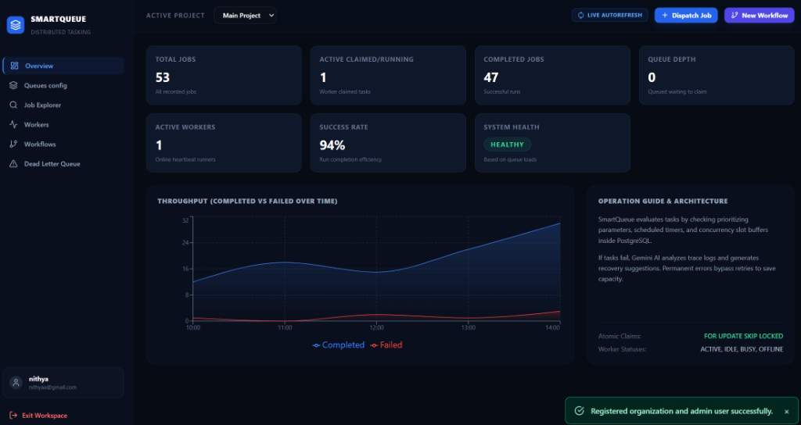
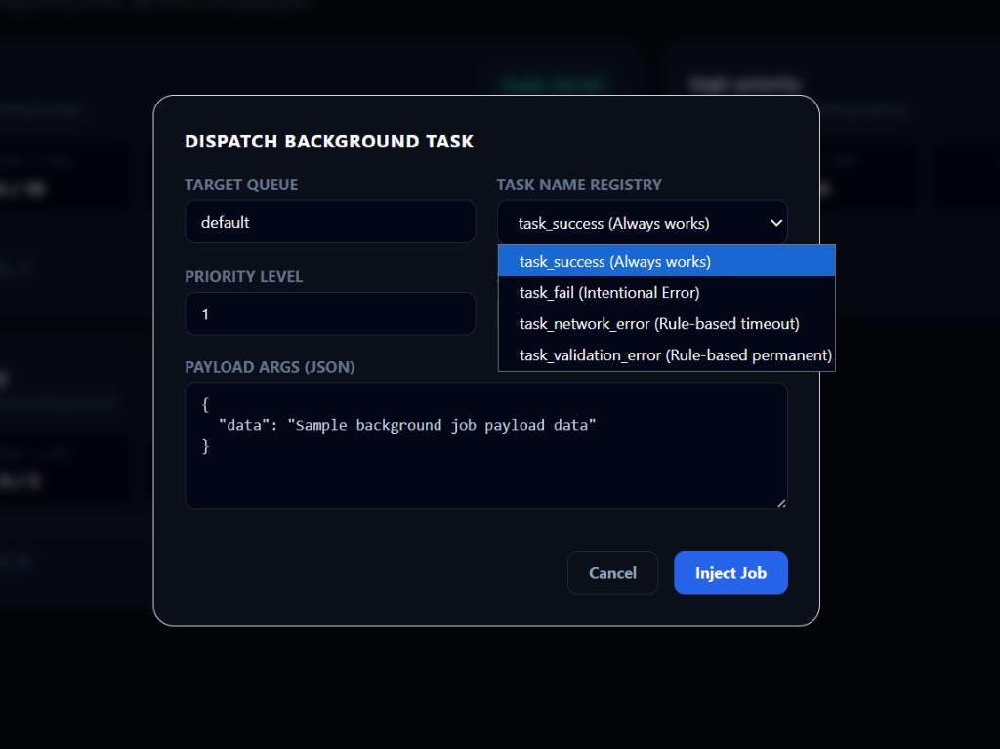
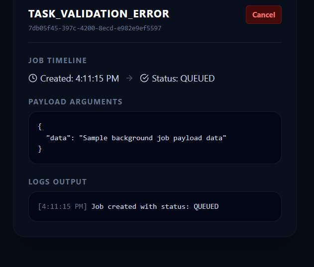
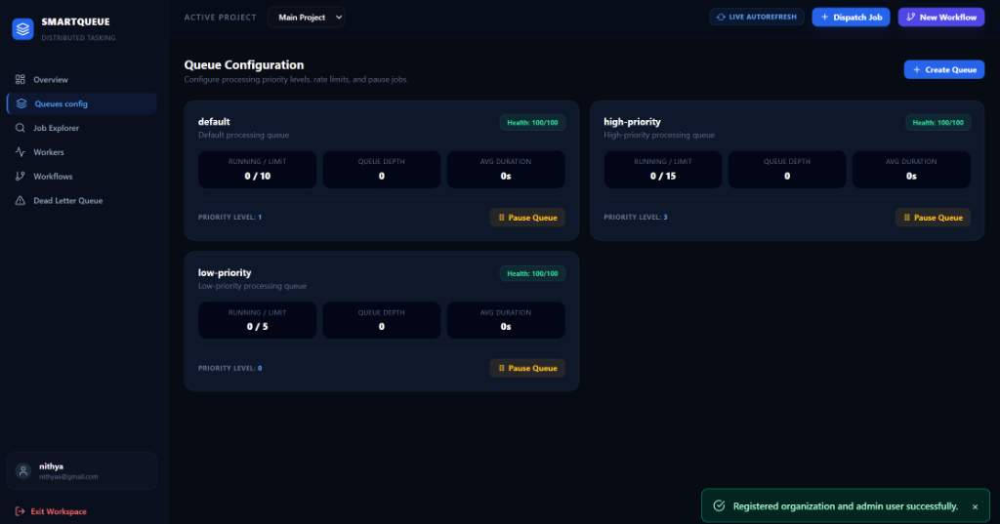
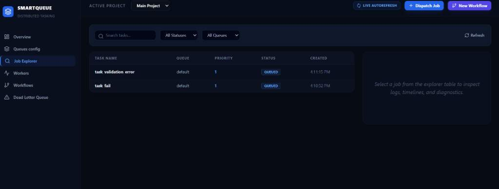

# SmartQueue Frontend

## Overview
The SmartQueue Frontend is a professional, high-performance monitoring and management dashboard built for SRE and operations teams. It displays real-time execution statistics, active worker container metrics, multi-queue slot limits, sequence workflow status maps, and intelligent Gemini AI failure diagnostics.

---

## Technology Stack
The frontend application is built on top of the following technologies:
* **React** (v18.3) - Single-page application logic and state management
* **Vite** (v5.2) - High-speed module bundling and hot-reload development server
* **TailwindCSS** (v3.4) - Modern utility-first layout styling and theme tokens
* **Recharts** (v2.12) - Modular SVG area charts for throughput telemetry
* **Lucide React** (v0.379) - SVG icon library for status and action visualizers
* **Fetch API** - Native browser HTTP requests calling the FastAPI endpoints

---

## Frontend Features

### 1. Overview Dashboard
* Displays total jobs, running jobs, completed jobs, queue depth, active workers, success rates, and overall system health scoring.
* Renders a real-time area chart monitoring system throughput (Completed vs Failed runs over time).
* Includes an operation guide summary detailing row-level transactional locking mechanisms.

### 2. Queue Configuration
* Lists active queues (e.g. `default`, `high-priority`, `low-priority`) with their health status.
* Displays running/concurrency limit capacities, queue depths, average execution times, and custom priorities.
* Offers dynamic Pause/Resume hooks and queue creation forms.

### 3. Job Explorer
* Provides full-text search, status dropdown filters, and table grids showing task details.
* Renders detail drawers showing specific job IDs, timeline steps, payload parameter JSON structures, stdout logs console, and automated Gemini AI failure diagnoses.

### 4. Worker Monitoring
* Displays a grid of worker containers auditing online heartbeats, status categories (ACTIVE, IDLE, BUSY, OFFLINE), and real-time CPU/memory utilization progress bars.

### 5. Workflow Management
* Visualizes DAG pipeline workflow sequences and step dependency status maps.

### 6. Dead Letter Queue
* Isolates failed jobs that exceeded retry thresholds, enabling raw stack traces inspection and manual requeue retry executions.

### 7. Dispatch Job
* Opens an overlay modal form to manually inject tasks, specifying target queues, task registries, priorities, and custom payload arguments.

### 8. Live Auto Refresh
* Uses periodic polling intervals (5 seconds) to fetch updated database metrics when enabled.

---

## API Integration
The React client communicates with the FastAPI backend using these endpoints:
* `POST /auth/register` (Account signup)
* `POST /auth/login` (Authentication access token)
* `GET /projects` (Load namespaces)
* `GET /projects/{id}/summary` (Retrieve dashboard metrics)
* `GET /jobs` (Filter and search jobs list)
* `POST /jobs` (Inject new task)
* `POST /jobs/{id}/retry` (Requeue failed job)
* `POST /jobs/{id}/cancel` (Terminate running job)
* `GET /jobs/{id}/executions` (Fetch run logs)
* `GET /jobs/{id}/logs` (Fetch stdout streams)
* `GET /jobs/{id}/failure-analysis` (AI diagnostic caching)
* `GET /queues` (Load queues)
* `POST /queues` (Create custom queue limits)
* `POST /queues/{id}/pause` & `POST /queues/{id}/resume` (Pause/Resume queues)
* `GET /workers` (Auditing active nodes)
* `GET /workflows` (Workflow list)
* `POST /workflows` (Trigger sequential pipeline)
* `GET /dlq` (Dead-letter audit logs)
* `POST /dlq/{id}/retry` (Retry dead-letter job)

---

## Project Structure
```
frontend/
├── docs/
│   └── screenshots/
│       ├── overview.png
│       ├── queues.png
│       ├── dispatch.png
│       ├── explorer.png
│       ├── details.png
│       ├── workers.png
│       ├── workflows.png
│       └── dead-letter-queue.png
├── public/
├── src/
│   ├── components/
│   │   ├── Sidebar.jsx
│   │   ├── Overview.jsx
│   │   ├── StatCard.jsx
│   │   ├── QueueConfig.jsx
│   │   ├── JobExplorer.jsx
│   │   ├── Workers.jsx
│   │   ├── Workflows.jsx
│   │   ├── DeadLetterQueue.jsx
│   │   ├── DispatchJobModal.jsx
│   │   └── NewWorkflowModal.jsx
│   ├── App.jsx
│   ├── api.js
│   ├── index.css
│   └── main.jsx
├── package.json
├── vite.config.js
└── README.md
```

---

## Running the Frontend

### 1. Installation
Install project dependencies:
```bash
npm install
```

### 2. Execution
Start the local development server:
```bash
npm run dev
```
The client dashboard will launch at:
`http://localhost:5173`

### 3. Backend Connection
The application connects dynamically to the FastAPI backend. It checks `import.meta.env.VITE_API_URL` during building, defaulting to `http://localhost:8000` in local development.

---

## Frontend Screenshots

### 1. Overview Dashboard

*Provides a real-time overview of distributed job execution, including total jobs, active jobs, completed jobs, queue depth, active workers, success rate, system health, and throughput.*

### 2. Workers

*Displays the active worker cluster, worker status, CPU utilization, memory allocation, completed jobs, failed jobs, and heartbeat information.*

### 3. Workflows

*Displays pipeline workflows and their sequential job dependencies.*

### 4. Dead Letter Queue (DLQ)

*Displays permanently failed jobs after retry limits are exceeded and provides a view for failure analysis and recovery.*

### 5. Queues Configuration

*Displays queue-related configuration and monitoring information.*

### 6. Job Explorer

*Provides detailed visibility into individual jobs, including their execution status and related information.*
